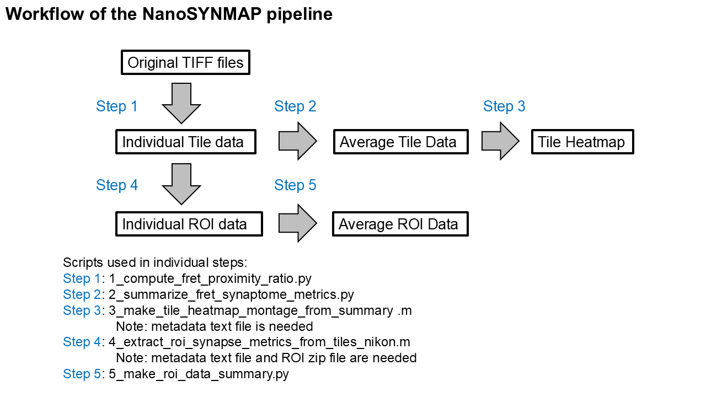

# FRET Synaptome Analysis (NanoSYNMAP) Pipeline

> **A comprehensive pipeline for synapse-level quantification from wide-field/tiled microscopy images of brain sections**

[](https://www.python.org/)
[](https://www.mathworks.com/)
[](LICENSE)

## Overview

This repository provides an integrated **Python + MATLAB** pipeline for analyzing FRET (Förster Resonance Energy Transfer) data at the synapse level. The pipeline enables:

1. 🔬 **Detection** of synaptic puncta from TIFF images with FRET efficiency computation
2. 📊 **Summarization** of tile-level metrics with imaging metadata visualization
3. 🎯 **ROI extraction** using Fiji/ImageJ ROI files for region-specific analysis


---

## 📋 Table of Contents

- [Overview](#overview)
- [Workflow](#workflow)
- [Directory Structure](#directory-structure)
- [Requirements](#requirements)
- [Installation](#installation)
- [Configuration](#configuration)
- [Input Data](#input-data)
- [Quick Start](#quick-start)
- [Pipeline Scripts](#pipeline-scripts)
- [Outputs](#outputs)
- [License](#license)

---

## 🔄 Workflow



*Complete analysis pipeline from raw image acquisition to ROI-level statistical summaries*

---

## 📁 Directory Structure

The pipeline expects the following directory organization:

```text
project-root/
├── 📄 README.md
├── 📄 environment.yml
├── 📂 scripts/
├── 📂 config/
├── 📂 data/
│   ├── 📂 raw_images/
│   │   └── 📂 {sample_id}/
│   │       ├── 📂 donor/
│   │       ├── 📂 acceptor/
│   │       └── 📂 fret/
│   └── 📂 csv/
│       └── 📂 {sample_id}/
└── 📂 results/
    ├── 📂 summary/
    ├── 📂 tile_heatmap/
    │   └── 📂 {sample_id}/
    ├── 📂 roi_data/
    │   ├── 📂 {sample_id}/
    │   └── 📂 roi/
    │       └── 📄 {sample_id}.zip
    └── 📂 roi_analysis/
        └── 📂 summary/
```

> **Note:** `{sample_id}` is a placeholder for your specific sample identifier (e.g., `sample_001`)

---

## 💻 Requirements

| Component | Details |
|-----------|---------|
| **Operating System** | Windows / macOS / Linux |
| **Python** | 3.x (see `environment.yml` for specific packages) |
| **MATLAB** | Version as specified in the manuscript |
| **Additional Tools** | Fiji/ImageJ (for ROI creation) |

### Key Python Dependencies
- NumPy, Pandas, SciPy
- scikit-image
- OpenCV
- Matplotlib

---

## 🚀 Installation

### Python Environment Setup

1. **Clone the repository:**
   ```bash
   git clone <repository-url>
   cd <repository-name>
   ```

2. **Create and activate the conda environment:**
   ```bash
   conda env create -f environment.yml
   conda activate fret-synaptome
   ```

3. **Verify installation:**
   ```bash
   python --version
   conda list
   ```

---

## ⚙️ Configuration

### Setup Steps

1. Create a JSON configuration file in the `config/` directory
2. Set the `sample_id` parameter to match your sample folder name
3. Configure analysis parameters specific to your experimental setup

### Example Configuration Structure

```json
{
  "sample_id": "sample_001",
  "threshold": 0.5,
  "pixel_size": 0.65,
  "other_parameters": "..."
}
```

> **Important:** All scripts use the `sample_id` from the config JSON to locate input/output folders automatically.

---

## 📥 Input Data

### 1. Microscopy Images

Place tiled microscopy images (`.tif` format) in the following directories:

```
data/raw_images/{sample_id}/donor/
data/raw_images/{sample_id}/acceptor/
data/raw_images/{sample_id}/fret/
```

### 2. Metadata File

For stitched/tile-level visualizations, include a metadata file (`.txt`) describing tile positions:

```
data/raw_images/{sample_id}/acceptor/metadata.txt
```

### 3. ROI Files (Optional)

For ROI-based analysis:
1. Create ROIs in Fiji/ImageJ
2. Export ROI files and compress into a ZIP archive
3. Place at: `results/roi_data/roi/{sample_id}.zip`

---

## 🎯 Quick Start

### Minimal Run Example

1. **Create directory structure:**
   ```bash
   mkdir -p data/raw_images config results
   ```

2. **Place input data** in the appropriate folders (see [Input Data](#input-data))

3. **Edit configuration:**
   - Update `config/*.json` with your `sample_id` and parameters

4. **Run the pipeline:**
   ```bash
   # Step 1: Compute FRET proximity ratio
   python scripts/1_compute_fret_proximity_ratio.py
   
   # Step 2: Summarize metrics
   python scripts/2_summarize_fret_synaptome_metrics.py
   
   # Step 3: Generate heatmaps (MATLAB)
   # Open MATLAB and run: 3_make_tile_heatmap_montage_from_summary.m
   
   # Step 4: Extract ROI data (MATLAB)
   # Run: 4_extract_roi_synapse_metrics_from_tiles_nikon.m
   
   # Step 5: Summarize ROI data
   python scripts/5_make_roi_data_summary.py
   ```

---

## 📜 Pipeline Scripts

### Python Scripts

| Script | Purpose | Input | Output |
|--------|---------|-------|--------|
| `1_compute_fret_proximity_ratio.py` | Computes FRET efficiency and proximity ratios from raw images | TIFF images | CSV files in `data/csv/{sample_id}/` |
| `2_summarize_fret_synaptome_metrics.py` | Aggregates tile-level metrics into summary statistics | CSV files | Summary CSV in `results/summary/` |
| `5_make_roi_data_summary.py` | Consolidates ROI-level data | ROI CSV files | Summary CSV in `results/roi_data/{sample_id}/` |

### MATLAB Scripts

| Script | Purpose | Input | Output |
|--------|---------|-------|--------|
| `3_make_tile_heatmap_montage_from_summary.m` | Generates spatial heatmap visualizations of tile-level metrics | Summary CSV + metadata | TIFF images in `results/tile_heatmap/{sample_id}/` |
| `4_extract_roi_synapse_metrics_from_tiles_nikon.m` | Extracts synapse metrics within user-defined ROIs | TIFF images + ROI ZIP | CSV files in `results/roi_data/{sample_id}/` |

---

## 📤 Outputs

The pipeline generates multiple output files organized by analysis stage:

### Stage 1: Per-Tile Analysis
- **Location:** `data/csv/{sample_id}/`
- **Format:** CSV files (one per tile)
- **Contents:** FRET efficiency, puncta counts, intensity metrics

### Stage 2: Summary Statistics
- **Location:** `results/summary/`
- **Format:** CSV file
- **Contents:** Aggregated metrics across all tiles

### Stage 3: Visualization
- **Location:** `results/tile_heatmap/{sample_id}/`
- **Format:** TIFF images
- **Contents:** Spatial heatmaps showing metric distributions

### Stage 4: ROI-Level Analysis
- **Location:** `results/roi_data/{sample_id}/`
- **Format:** CSV files
- **Contents:** Per-ROI synapse metrics and summary statistics

---

## 📄 License

This project is licensed under the **MIT License**. See the [`LICENSE`](LICENSE) file for details.

---
